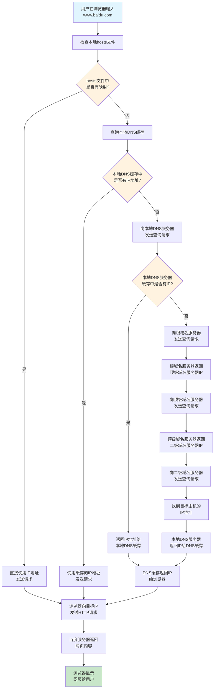
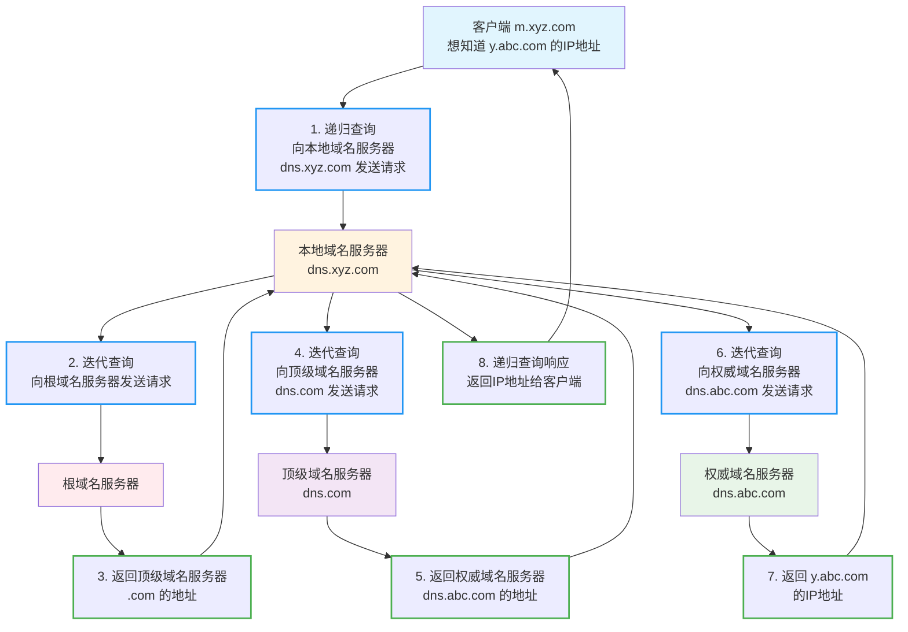

DNS（Domain Name System，域名系统）是互联网的重要基础设施，它将人类可读的域名转换为计算机可理解的 IP 地址。当我们在浏览器中输入网址时，DNS 解析过程在幕后默默工作，确保我们能够成功访问目标网站。

## DNS 解析基本流程图（以百度为例）



## DNS 递归查询与迭代查询详细架构图

以下流程图展示了 DNS 查询的完整技术架构，详细说明了递归查询和迭代查询的工作机制。这个例子展示了客户端 `m.xyz.com` 查询 `y.abc.com` 的 IP 地址的完整过程：



这个架构图清楚地展示了：

- **递归查询**：客户端向本地 DNS 服务器发送查询请求，本地 DNS 服务器负责完成整个查询过程
- **迭代查询**：本地 DNS 服务器依次向根域名服务器、顶级域名服务器、权威域名服务器发送查询请求
- **查询路径**：从根域名服务器开始，逐级向下查询，直到找到目标域名的 IP 地址
- **响应路径**：查询结果沿着相同的路径返回给客户端

## 根域名服务器

根域名服务器（英语：root name server，简称“根域名服务器”）是互联网域名解析系统（DNS）中最高级别的域名服务器，负责返回顶级域的权威域名服务器地址。它们是互联网基础设施中的重要部分，因为所有域名解析操作均离不开它们。由于 DNS 和某些协议（未分片的用户数据报协议（UDP）数据包在 IPv4 内的最大有效大小为 512 字节）的共同限制，根域名服务器地址的数量被限制为 13 个。幸运的是，采用任播技术架设镜像服务器可解决该问题，并使得实际运行的根域名服务器数量大大增加。截至 2023 年 6 月，全球共有 1719 台根域名服务器在运行。

所有根域名服务器都是以同一份根域文件（Root Zone file，文件名为 root.zone）返回顶级域名权威服务器（包括通用顶级域和国家顶级域），文件只有 2MB[33]大小。截至 2017 年 10 月 9 日，一共记录了 1542 个顶级域。对于没被收录的顶级域，是没法通过根域名服务器查出相应的权威服务器。而其他递归 DNS 服务器则只需要配置 Root Hits 文件，只包含根域名服务器的地址。

## 顶级域名服务器

例如 .cn .com .gov .edu 等等为常见的顶级域名，顶级域名服务器用来处理对应的域名，并向二级域名的权威域名服务器查询具体的 IP。

## 权威域名服务器

权威 DNS 服务器（Authoritative DNS Server）是指对特定域名（如 example.com）及其下属子域名（如 sub.example.com）的 DNS 查询提供权威答案的服务器。这意味着，当你想要知道某个特定域名的 IP 地址时，权威 DNS 服务器提供的答案是最终的、权威的。它直接从域名的注册记录中获取信息，而不是依赖于其他服务器的缓存数据。权威域名服务器可以是主服务器或辅助服务器，通常由域名注册商或域名持有者指定和管理。

## 递归 DNS 服务器

当我们在电脑中指定 DNS 服务器时，通常指定的是递归 DNS 服务器。这个服务器会代表客户端进行一系列查询，直到找到域名对应的 IP 地址。这可能包括向根 DNS 服务器、TLD 服务器和权威 DNS 服务器的查询。

### 常用的公共 DNS 服务器

**国际服务商：**

- Google DNS: `8.8.8.8`, `8.8.4.4`
- Cloudflare DNS: `1.1.1.1`, `1.0.0.1`
- OpenDNS: `208.67.222.222`, `208.67.220.220`

**国内服务商：**

- 114 DNS: `114.114.114.114`, `114.114.115.115`
- 阿里云 DNS: `223.5.5.5`, `223.6.6.6`
- 腾讯 DNS: `119.29.29.29`, `182.254.116.116`
- 百度 DNS: `180.76.76.76`

## DNS 缓存机制

DNS 系统采用多级缓存机制来提高查询效率：

1. **浏览器缓存**：浏览器会缓存 DNS 查询结果，通常缓存时间为几分钟到几小时
2. **操作系统缓存**：操作系统级别的 DNS 缓存，可以通过命令清除
3. **路由器缓存**：家用路由器通常也会缓存 DNS 查询结果
4. **ISP 缓存**：互联网服务提供商的 DNS 服务器会缓存热门域名的解析结果

### 清除 DNS 缓存的方法

**Windows:**

```bash
ipconfig /flushdns
```

**macOS:**

```bash
sudo dscacheutil -flushcache
sudo killall -HUP mDNSResponder
```

**Linux:**

```bash
sudo systemctl restart systemd-resolved
# 或者
sudo service nscd restart
```

## DNS 记录类型

DNS 系统支持多种记录类型，每种类型服务于不同的目的：

| 记录类型 | 用途                   | 示例                             |
| -------- | ---------------------- | -------------------------------- |
| A        | 将域名映射到 IPv4 地址 | `example.com → 192.0.2.1`        |
| AAAA     | 将域名映射到 IPv6 地址 | `example.com → 2001:db8::1`      |
| CNAME    | 创建域名别名           | `www.example.com → example.com`  |
| MX       | 指定邮件服务器         | `example.com → mail.example.com` |
| TXT      | 存储文本信息           | 用于域名验证、SPF 记录等         |
| NS       | 指定域名服务器         | `example.com → ns1.example.com`  |

## 总结

DNS 解析是一个复杂但高效的分布式系统，通过递归查询和迭代查询的配合，以及多级缓存机制的支持，确保了互联网域名解析的快速和可靠。
