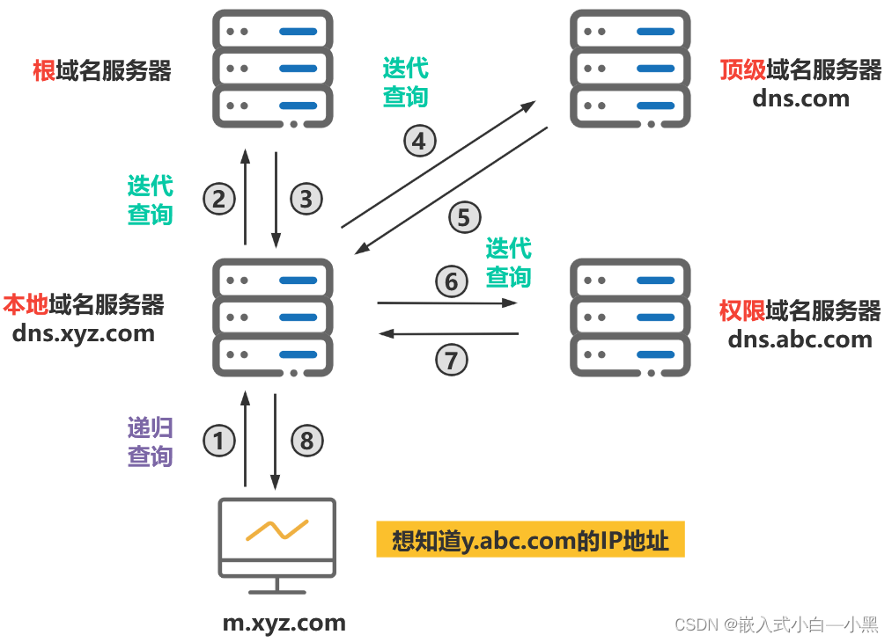

# 访问网络时 DNS 的过程.md

## 以百度为例

1. 当用户在浏览器中输入百度的域名（www.baidu.com），浏览器会首先检查本地hosts文件中是否存在对应的映射关系。

2. 如果在 hosts 文件中找到了对应的映射关系，浏览器会将主机名解析为对应的 IP 地址，并直接向该 IP 地址发送请求。

3. 如果在 hosts 文件中未找到对应的映射关系，则浏览器会向本地 DNS 缓存发送查询请求。

4. 如果在本地 DNS 缓存中找到了对应的 IP 地址，浏览器会将主机名解析为对应的 IP 地址，并直接向该 IP 地址发送请求。

5. 如果在本地 DNS 缓存中未找到对应的 IP 地址，则本地 DNS 缓存会向本地 DNS 服务器发送查询请求。

6. 本地 DNS 服务器会检查自己的缓存，如果找到了对应的 IP 地址，它会将结果返回给本地 DNS 缓存。

7. 如果本地 DNS 服务器未找到对应的 IP 地址，它会根据域名的层次结构，从根域名服务器开始逐级查询。

8. 本地 DNS 服务器会向根域名服务器发送查询请求，根域名服务器会返回顶级域名服务器的 IP 地址。

9. 本地 DNS 服务器会向顶级域名服务器发送查询请求，顶级域名服务器会返回二级域名服务器的 IP 地址。

10. 本地 DNS 服务器会继续向二级域名服务器发送查询请求，直到找到与主机名对应的 IP 地址。

11. 一旦本地 DNS 服务器找到了对应的 IP 地址，它会将结果返回给本地 DNS 缓存。

12. 本地 DNS 缓存将结果返回给浏览器，浏览器将主机名解析为 IP 地址，并向该 IP 地址发送请求。

13. 百度服务器接收到请求后，会返回相应的网页内容给浏览器，浏览器将网页内容显示给用户。
14.

## 根域名服务器

根域名服务器（英语：root name server，简称“根域名服务器”）是互联网域名解析系统（DNS）中最高级别的域名服务器，负责返回顶级域的权威域名服务器地址。它们是互联网基础设施中的重要部分，因为所有域名解析操作均离不开它们。由于 DNS 和某些协议（未分片的用户数据报协议（UDP）数据包在 IPv4 内的最大有效大小为 512 字节）的共同限制，根域名服务器地址的数量被限制为 13 个。幸运的是，采用任播技术架设镜像服务器可解决该问题，并使得实际运行的根域名服务器数量大大增加。截至 2023 年 6 月，全球共有 1719 台根域名服务器在运行。

所有根域名服务器都是以同一份根域文件（Root Zone file，文件名为 root.zone）返回顶级域名权威服务器（包括通用顶级域和国家顶级域），文件只有 2MB[33]大小。截至 2017 年 10 月 9 日，一共记录了 1542 个顶级域。对于没被收录的顶级域，是没法通过根域名服务器查出相应的权威服务器。而其他递归 DNS 服务器则只需要配置 Root Hits 文件，只包含根域名服务器的地址。

## 顶级域名服务器

例如 .cn .com .gov .edu 等等为常见的顶级域名，顶级域名服务器用来处理对应的域名，并向二级域名的权威域名服务器查询具体的 IP。

## 权威域名服务器

权威 DNS 服务器（Authoritative DNS Server）是指对特定域名（如 example.com）及其下属子域名（如 sub.example.com）的 DNS 查询提供权威答案的服务器这意味着，当你想要知道某个特定域名的 IP 地址时，权威 DNS 服务器提供的答案是最终的、权威的。它直接从域名的注册记录中获取信息，而不是依赖于其他服务器的缓存数据。权威域名服务器可以是主服务器或辅助服务器，通常由域名注册商或域名持有者指定和管理。

## 递归 DNS 服务器

当我们在电脑中指定 DNS 服务器时，通常指定的是递归 DNS 服务器。这个服务器会代表客户端进行一系列查询，直到找到域名对应的 IP 地址。这可能包括向根 DNS 服务器、TLD 服务器和权威 DNS 服务器的查询。递归 DNS 服务器通常由 ISP 运营，也可能由一些大型互联网公司提供，如 Google 的 8.8.8.8、国内电信联通移动的 114.114.114.114
