# NetworkManager 有线网络（以太网）连接流程

## 概述

本文全面梳理了 NetworkManager 在有线网络（以太网）连接过程中的工作机制，主要包括以下核心内容：

1. **连接激活流程**

   - Stage 1：设备准备阶段（链路协商、PPPoE 重连控制）
   - Stage 2：设备配置阶段（802.1X 认证、DCB/FCoE、WOL）
   - Stage 3：IP 配置阶段（DHCP/静态 IP/PPPoE）

2. **网络层次协议栈**

   - 物理层：链路协商（自动协商、速率、双工模式）
   - 数据链路层：802.1X 认证、PPPoE 封装
   - 网络层：IP 配置（DHCP/静态/PPPoE）

3. **关键功能模块**

   - DHCP 协议实现（客户端选择、状态机、选项处理）
   - 802.1X 认证（EAP 方法、密钥管理、认证状态）
   - PPPoE 拨号（会话建立、认证、IP 配置）
   - DCB/FCoE 载波控制

4. **实现与调试**

   - 错误处理与重试机制
   - 状态转换与超时控制
   - 核心源文件结构
   - 调试与排错方法

---

## 总体激活时序（高层）

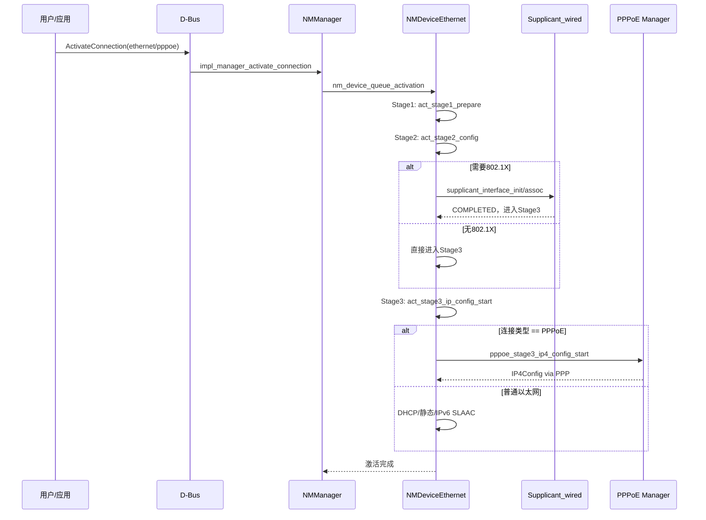
```mermaid
sequenceDiagram
    participant User as 用户/应用
    participant DBus as D-Bus
    participant Manager as NMManager
    participant Device as NMDeviceEthernet
    participant Supp as Supplicant_wired
    participant PPP as PPPoE Manager

    User->>DBus: ActivateConnection(ethernet/pppoe)
    DBus->>Manager: impl_manager_activate_connection
    Manager->>Device: nm_device_queue_activation
    Device->>Device: Stage1: act_stage1_prepare
    Device->>Device: Stage2: act_stage2_config
    alt 需要802.1X
        Device->>Supp: supplicant_interface_init/assoc
        Supp-->>Device: COMPLETED，进入Stage3
    else 无802.1X
        Device->>Device: 直接进入Stage3
    end
    Device->>Device: Stage3: act_stage3_ip_config_start
    alt 连接类型 == PPPoE
        Device->>PPP: pppoe_stage3_ip4_config_start
        PPP-->>Device: IP4Config via PPP
    else 普通以太网
        Device->>Device: DHCP/静态/IPv6 SLAAC
    end
    Device-->>Manager: 激活完成
```

---

## Stage 1：设备准备（链路协商/PPPoE 重连节流）

关键点：

- 链路协商设置：自协商、速率、双工（必要时写入 ethtool 设置）
- PPPoE 断开后的短时重连节流（避免对端困惑）

### 链路协商流程

链路协商是在网卡与直接连接的对端设备（如交换机/路由器）之间进行的物理层和数据链路层自动协商过程：

1. **协商参与方**：

   - 本端：网卡 PHY（物理层收发器）
   - 对端：交换机/路由器端口 PHY

2. **软件控制链**：

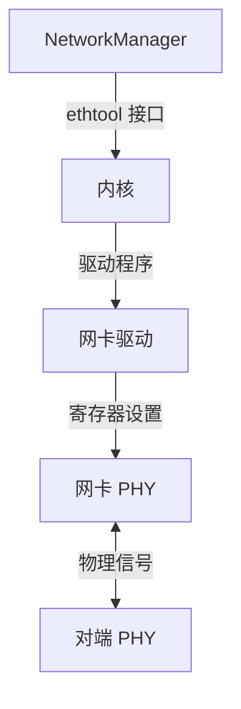
```mermaid
flowchart TD
    A[NetworkManager] -->|ethtool 接口| B[内核]
    B -->|驱动程序| C[网卡驱动]
    C -->|寄存器设置| D[网卡 PHY]
    D <-->|物理信号| E[对端 PHY]
```

1. **可协商参数**：

   - 速率（10/100/1000Mbps）
   - 双工模式（全双工/半双工）
   - 流控制
   - 特定功能（如 EEE 节能以太网）

2. **协商流程**：

   - NetworkManager 通过 ethtool 接口配置期望参数
   - 驱动将配置写入网卡寄存器
   - 网卡 PHY 与对端 PHY 通过物理信号协商
   - 协商结果通过中断通知驱动，反馈给上层

### 状态机流程

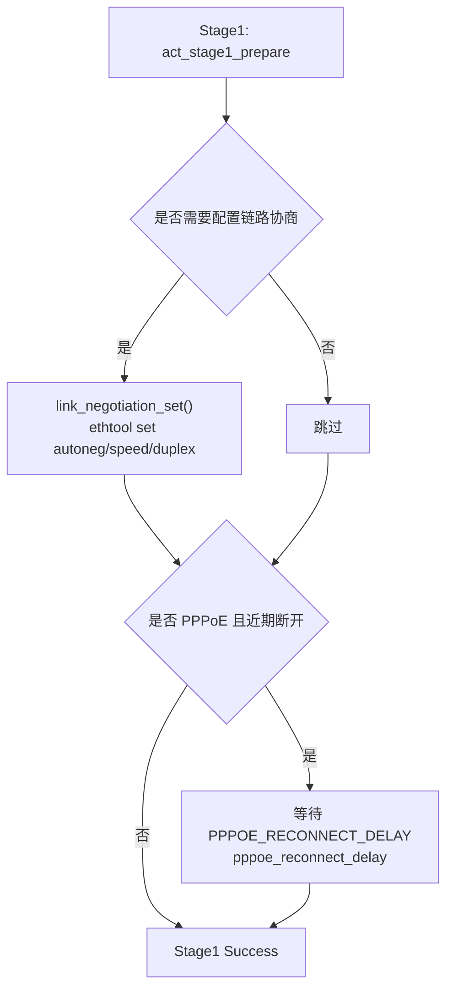
```mermaid
flowchart TD
    A["Stage1: act_stage1_prepare"] --> B{"是否需要配置链路协商"}
    B -->|是| C["link_negotiation_set()<br/>ethtool set autoneg/speed/duplex"]
    B -->|否| D["跳过"]
    C --> E{"是否 PPPoE 且近期断开"}
    D --> E
    E -->|是| F["等待 PPPOE_RECONNECT_DELAY<br/>pppoe_reconnect_delay"]
    E -->|否| G["Stage1 Success"]
    F --> G
```

### 名词解释

- PPPoE: 运行在以太网上的 PPP(点对点)协议，主要用来身份认证和管理 IP 地址分配。
- ISP: 网络运行供应商（eg: 移动、电信、联通）
- PHY: 全称 Physical Layer。PHY 层是网络设备（如网卡、交换机端口）的“物理接口翻译官”。它负责将所有数字数据（0 和 1）转换成能在网线、光纤等物理线缆上传输的电磁波或光信号，反之亦然。

### 重要说明

- 链路协商配置失败时仅记录警告，不会阻断设备激活流程
- 实际协商在硬件 PHY 层完成，软件只提供期望参数
- 对端设备可能强制特定模式，覆盖本端配置
- PPPoE 重连节流是为避免对端困惑，给予足够冷却时间

---

## Stage 2：设备配置（802.1X/DCB/WOL）

优先级：若要求 802.1X，则需在 IP 之前完成。DCB/FCoE 对载波有严格依赖，需要分阶段等待；WOL 根据配置设置。

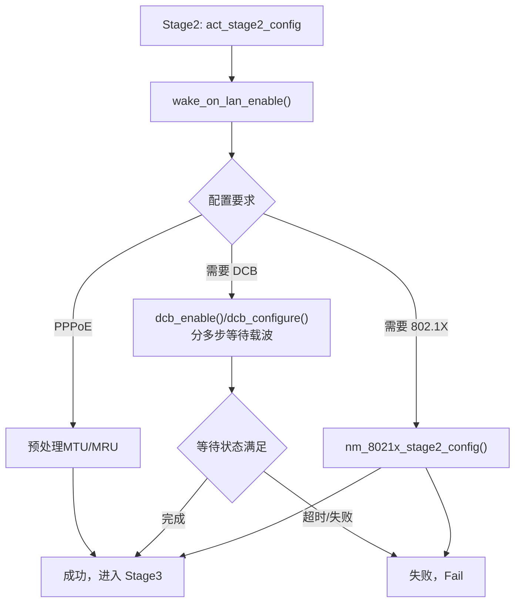
```mermaid
flowchart TD
    A["Stage2: act_stage2_config"] --> B["wake_on_lan_enable()"]
    B --> C{"配置要求"}
    C -->|需要 802.1X| D["nm_8021x_stage2_config()"]
    C -->|需要 DCB| E["dcb_enable()/dcb_configure()<br/>分多步等待载波"]
    C -->|PPPoE| F["预处理MTU/MRU"]
    D --> G["成功，进入 Stage3"]
    D --> H["失败，Fail"]
    E --> I{"等待状态满足"}
    I -->|完成| G
    I -->|超时/失败| H
    F --> G
```

---

## Stage 3：IP 配置（普通/PPPoE 分支）

一般的网络布局是用路由器做内外网的中转，此时路由器作为 PPPoE 客户端（WAN 口）和 ISP 的核心网络设备（BRAS）进行拨号认证，这样局域网只需要进行一次认证。在局域网环境，路由器的 LAN 口作为 DHCP 服务器，局域网设备和 DHCP 服务器通信获取 IP。如果是电脑直连光猫，那就要走 PPPoE 认证了。

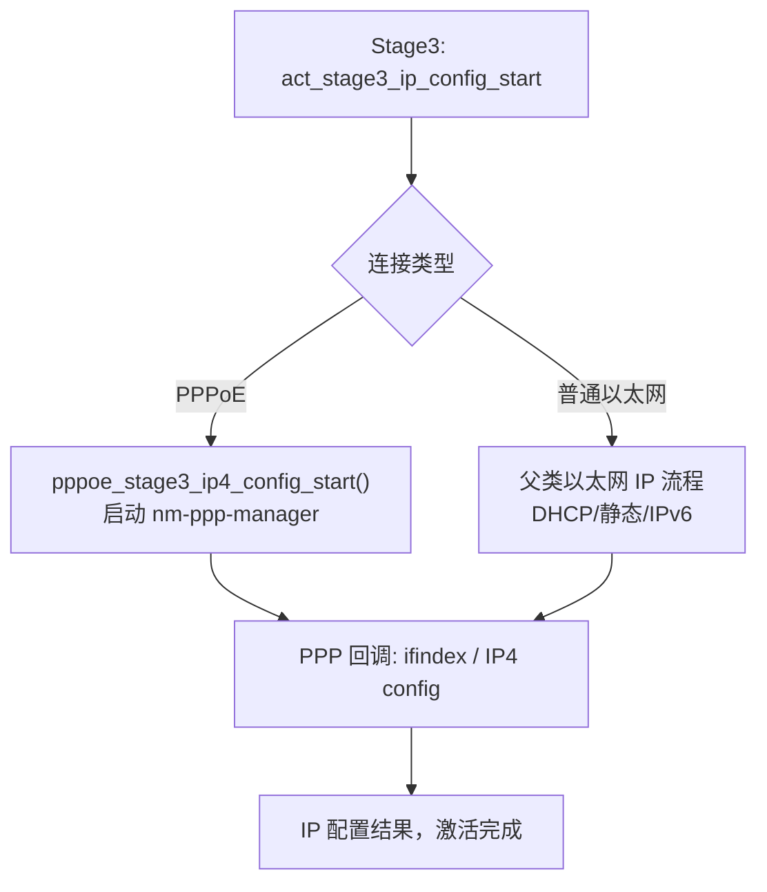
```mermaid
flowchart TD
    A["Stage3: act_stage3_ip_config_start"] --> B{"连接类型"}
    B -->|PPPoE| C["pppoe_stage3_ip4_config_start()<br/>启动 nm-ppp-manager"]
    B -->|普通以太网| D["父类以太网 IP 流程<br/>DHCP/静态/IPv6"]
    C --> E["PPP 回调: ifindex / IP4 config"]
    D --> E
    E --> F["IP 配置结果，激活完成"]
```

---

## DHCP 详细流程

当连接配置为自动获取 IP（`ipv4.method=auto`）时，将启动 DHCP 客户端获取网络配置。

### DHCP 客户端选择与启动

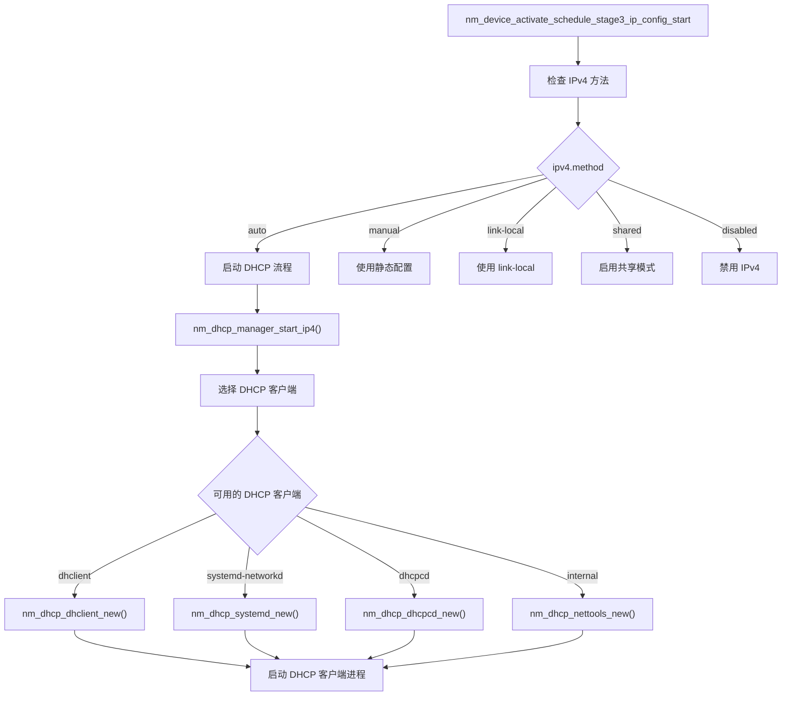
```mermaid
flowchart TD
    A["nm_device_activate_schedule_stage3_ip_config_start"] --> B["检查 IPv4 方法"]
    B --> C{"ipv4.method"}
    C -->|auto| D["启动 DHCP 流程"]
    C -->|manual| E["使用静态配置"]
    C -->|link-local| F["使用 link-local"]
    C -->|shared| G["启用共享模式"]
    C -->|disabled| H["禁用 IPv4"]

    D --> I["nm_dhcp_manager_start_ip4()"]
    I --> J["选择 DHCP 客户端"]
    J --> K{"可用的 DHCP 客户端"}
    K -->|dhclient| L["nm_dhcp_dhclient_new()"]
    K -->|systemd-networkd| M["nm_dhcp_systemd_new()"]
    K -->|dhcpcd| N["nm_dhcp_dhcpcd_new()"]
    K -->|internal| O["nm_dhcp_nettools_new()"]

    L --> P["启动 DHCP 客户端进程"]
    M --> P
    N --> P
    O --> P
```

### DHCP 状态机与事件处理

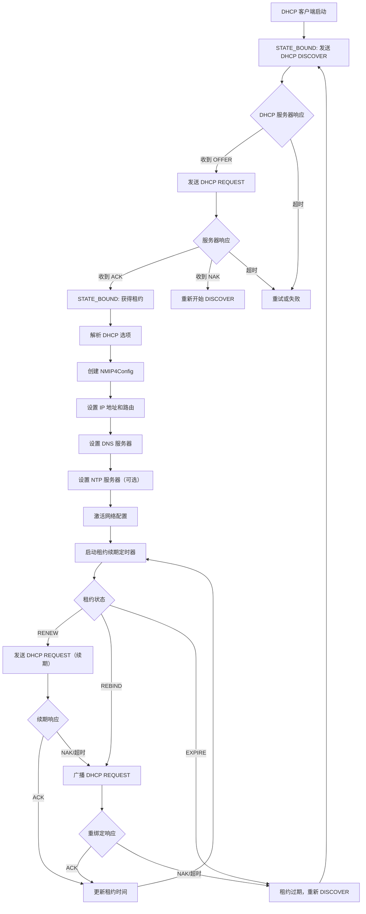
```mermaid
flowchart TD
    A["DHCP 客户端启动"] --> B["STATE_BOUND: 发送 DHCP DISCOVER"]
    B --> C{"DHCP 服务器响应"}
    C -->|收到 OFFER| D["发送 DHCP REQUEST"]
    C -->|超时| E["重试或失败"]

    D --> F{"服务器响应"}
    F -->|收到 ACK| G["STATE_BOUND: 获得租约"]
    F -->|收到 NAK| H["重新开始 DISCOVER"]
    F -->|超时| E

    G --> I["解析 DHCP 选项"]
    I --> J["创建 NMIP4Config"]
    J --> K["设置 IP 地址和路由"]
    K --> L["设置 DNS 服务器"]
    L --> M["设置 NTP 服务器（可选）"]
    M --> N["激活网络配置"]

    N --> O["启动租约续期定时器"]
    O --> P{"租约状态"}
    P -->|RENEW| Q["发送 DHCP REQUEST（续期）"]
    P -->|REBIND| R["广播 DHCP REQUEST"]
    P -->|EXPIRE| S["租约过期，重新 DISCOVER"]

    Q --> T{"续期响应"}
    T -->|ACK| U["更新租约时间"]
    T -->|NAK/超时| R

    R --> V{"重绑定响应"}
    V -->|ACK| U
    V -->|NAK/超时| S

    U --> O
    S --> B
```

### DHCP 选项处理与配置应用

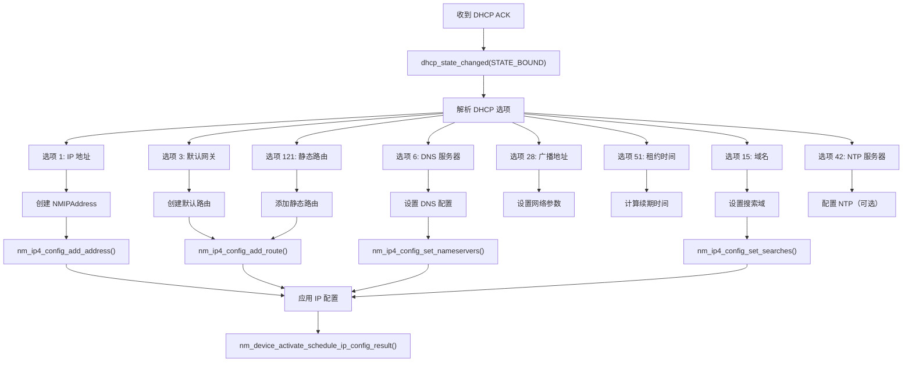
```mermaid
flowchart TD
    A["收到 DHCP ACK"] --> B["dhcp_state_changed(STATE_BOUND)"]
    B --> C["解析 DHCP 选项"]

    C --> D["选项 1: IP 地址"]
    C --> E["选项 3: 默认网关"]
    C --> F["选项 6: DNS 服务器"]
    C --> G["选项 15: 域名"]
    C --> H["选项 28: 广播地址"]
    C --> I["选项 51: 租约时间"]
    C --> J["选项 121: 静态路由"]
    C --> K["选项 42: NTP 服务器"]

    D --> L["创建 NMIPAddress"]
    E --> M["创建默认路由"]
    F --> N["设置 DNS 配置"]
    G --> O["设置搜索域"]
    H --> P["设置网络参数"]
    I --> Q["计算续期时间"]
    J --> R["添加静态路由"]
    K --> S["配置 NTP（可选）"]

    L --> T["nm_ip4_config_add_address()"]
    M --> U["nm_ip4_config_add_route()"]
    N --> V["nm_ip4_config_set_nameservers()"]
    O --> W["nm_ip4_config_set_searches()"]
    R --> U

    T --> X["应用 IP 配置"]
    U --> X
    V --> X
    W --> X
    X --> Y["nm_device_activate_schedule_ip_config_result()"]
```

### DHCP 失败处理与重试机制

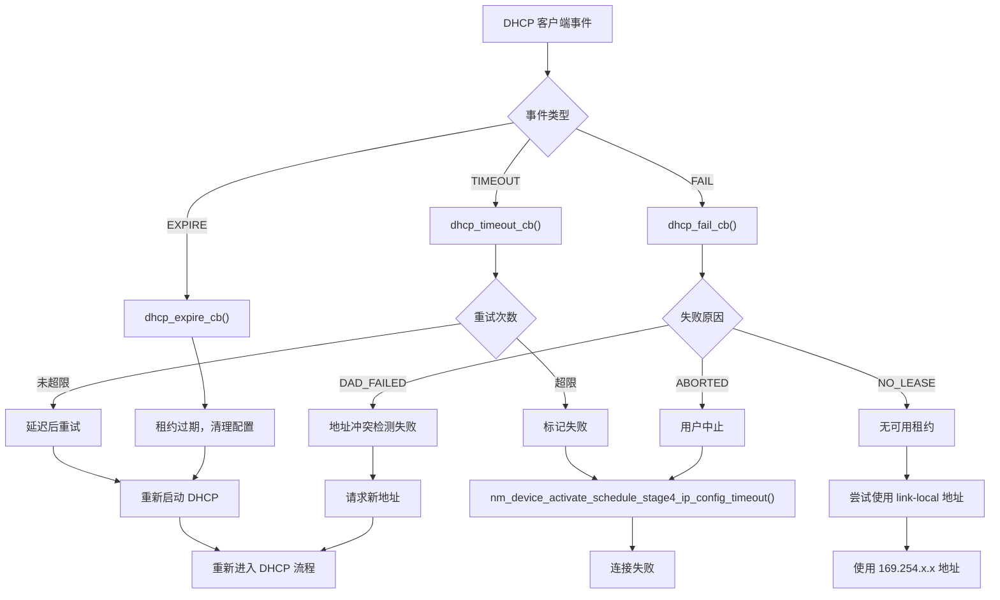
```mermaid
flowchart TD
    A["DHCP 客户端事件"] --> B{"事件类型"}
    B -->|TIMEOUT| C["dhcp_timeout_cb()"]
    B -->|FAIL| D["dhcp_fail_cb()"]
    B -->|EXPIRE| E["dhcp_expire_cb()"]

    C --> F{"重试次数"}
    F -->|未超限| G["延迟后重试"]
    F -->|超限| H["标记失败"]

    D --> I{"失败原因"}
    I -->|NO_LEASE| J["无可用租约"]
    I -->|DAD_FAILED| K["地址冲突检测失败"]
    I -->|ABORTED| L["用户中止"]

    E --> M["租约过期，清理配置"]

    G --> N["重新启动 DHCP"]
    H --> O["nm_device_activate_schedule_stage4_ip_config_timeout()"]
    J --> P["尝试使用 link-local 地址"]
    K --> Q["请求新地址"]
    L --> O
    M --> N

    N --> R["重新进入 DHCP 流程"]
    O --> S["连接失败"]
    P --> T["使用 169.254.x.x 地址"]
    Q --> R
```

### DHCP 客户端进程管理

不同的 DHCP 客户端有不同的实现方式：

**dhclient（ISC DHCP）**：

- 通过 `/usr/sbin/dhclient` 进程
- 使用配置文件 `/var/lib/NetworkManager/dhclient-<iface>.conf`
- 租约文件 `/var/lib/NetworkManager/dhclient-<iface>.leases`

**systemd-networkd**：

- 通过 systemd D-Bus 接口
- 集成到 systemd-networkd 服务中

**内部实现（nettools）**：

- NetworkManager 内置 DHCP 客户端
- 基于 n-dhcp4 库实现

### 关键函数调用链

```c
// src/dhcp/nm-dhcp-manager.c
nm_dhcp_manager_start_ip4()
├── 选择 DHCP 客户端类型
├── nm_dhcp_client_start()
└── 注册状态变化回调

// src/dhcp/nm-dhcp-client.c
nm_dhcp_client_start()
├── 构建 DHCP 配置
├── 启动客户端进程
└── nm_dhcp_client_watch_child()

// DHCP 事件回调
dhcp_state_changed()
├── 解析 DHCP 响应
├── 创建 IP 配置对象
└── nm_device_activate_schedule_ip_config_result()
```

---

## 内部 DHCP 客户端（nettools）详细流程

NetworkManager 的内部 DHCP 客户端基于 n-dhcp4 库实现，通过 `nm-dhcp-nettools.c` 进行封装。相比外部进程（如 dhclient），内部实现具有更好的集成性和性能。

### 内部 DHCP 客户端架构

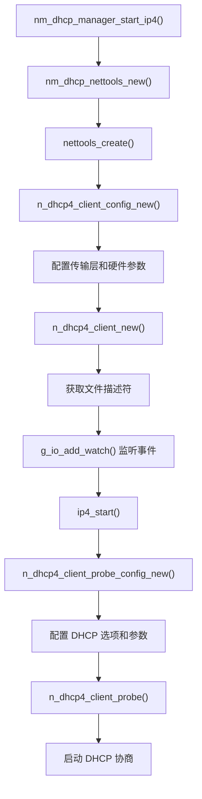
```mermaid
flowchart TD
    A["nm_dhcp_manager_start_ip4()"] --> B["nm_dhcp_nettools_new()"]
    B --> C["nettools_create()"]
    C --> D["n_dhcp4_client_config_new()"]
    D --> E["配置传输层和硬件参数"]
    E --> F["n_dhcp4_client_new()"]
    F --> G["获取文件描述符"]
    G --> H["g_io_add_watch() 监听事件"]
    H --> I["ip4_start()"]
    I --> J["n_dhcp4_client_probe_config_new()"]
    J --> K["配置 DHCP 选项和参数"]
    K --> L["n_dhcp4_client_probe()"]
    L --> M["启动 DHCP 协商"]
```

### n-dhcp4 库状态机

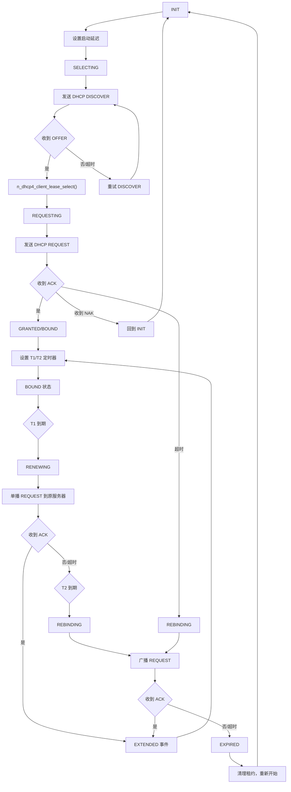
```mermaid
flowchart TD
    A["INIT"] --> B["设置启动延迟"]
    B --> C["SELECTING"]
    C --> D["发送 DHCP DISCOVER"]

    D --> E{"收到 OFFER"}
    E -->|是| F["n_dhcp4_client_lease_select()"]
    E -->|否/超时| G["重试 DISCOVER"]

    F --> H["REQUESTING"]
    H --> I["发送 DHCP REQUEST"]

    I --> J{"收到 ACK"}
    J -->|是| K["GRANTED/BOUND"]
    J -->|收到 NAK| L["回到 INIT"]
    J -->|超时| M["REBINDING"]

    K --> N["设置 T1/T2 定时器"]
    N --> O["BOUND 状态"]

    O --> P{"T1 到期"}
    P --> Q["RENEWING"]
    Q --> R["单播 REQUEST 到原服务器"]

    R --> S{"收到 ACK"}
    S -->|是| T["EXTENDED 事件"]
    S -->|否/超时| U{"T2 到期"}

    U --> V["REBINDING"]
    V --> W["广播 REQUEST"]

    W --> X{"收到 ACK"}
    X -->|是| T
    X -->|否/超时| Y["EXPIRED"]

    T --> N
    Y --> Z["清理租约，重新开始"]
    Z --> A
    G --> D
    L --> A
    M --> W
```

### 事件处理流程

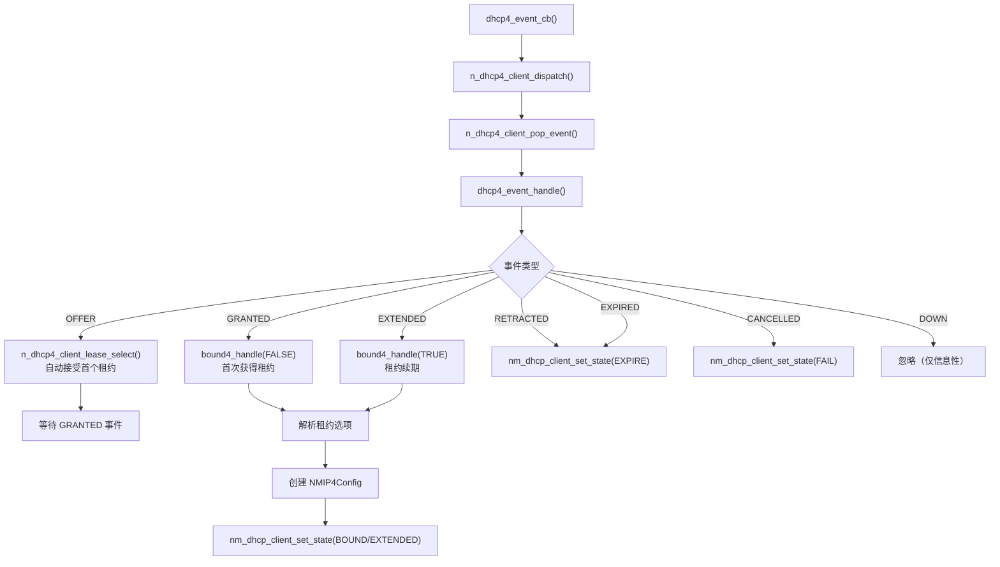
```mermaid
flowchart TD
    A["dhcp4_event_cb()"] --> B["n_dhcp4_client_dispatch()"]
    B --> C["n_dhcp4_client_pop_event()"]
    C --> D["dhcp4_event_handle()"]

    D --> E{"事件类型"}
    E -->|OFFER| F["n_dhcp4_client_lease_select()<br/>自动接受首个租约"]
    E -->|GRANTED| G["bound4_handle(FALSE)<br/>首次获得租约"]
    E -->|EXTENDED| H["bound4_handle(TRUE)<br/>租约续期"]
    E -->|RETRACTED| I["nm_dhcp_client_set_state(EXPIRE)"]
    E -->|EXPIRED| I
    E -->|CANCELLED| J["nm_dhcp_client_set_state(FAIL)"]
    E -->|DOWN| K["忽略（仅信息性）"]

    F --> L["等待 GRANTED 事件"]
    G --> M["解析租约选项"]
    H --> M
    M --> N["创建 NMIP4Config"]
    N --> O["nm_dhcp_client_set_state(BOUND/EXTENDED)"]
```

### 配置与选项处理

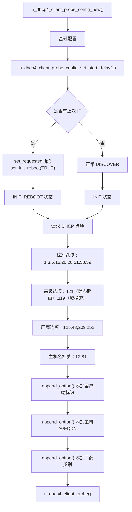
```mermaid
flowchart TD
    A["n_dhcp4_client_probe_config_new()"] --> B["基础配置"]
    B --> C["n_dhcp4_client_probe_config_set_start_delay(1)"]
    C --> D{"是否有上次 IP"}
    D -->|是| E["set_requested_ip()<br/>set_init_reboot(TRUE)"]
    D -->|否| F["正常 DISCOVER"]

    E --> G["INIT_REBOOT 状态"]
    F --> H["INIT 状态"]

    G --> I["请求 DHCP 选项"]
    H --> I

    I --> J["标准选项：1,3,6,15,26,28,51,58,59"]
    J --> K["高级选项：121（静态路由）,119（域搜索）"]
    K --> L["厂商选项：125,43,209,252"]
    L --> M["主机名相关：12,81"]

    M --> N["append_option() 添加客户端标识"]
    N --> O["append_option() 添加主机名/FQDN"]
    O --> P["append_option() 添加厂商类别"]
    P --> Q["n_dhcp4_client_probe()"]
```

### 租约处理与 IP 配置生成

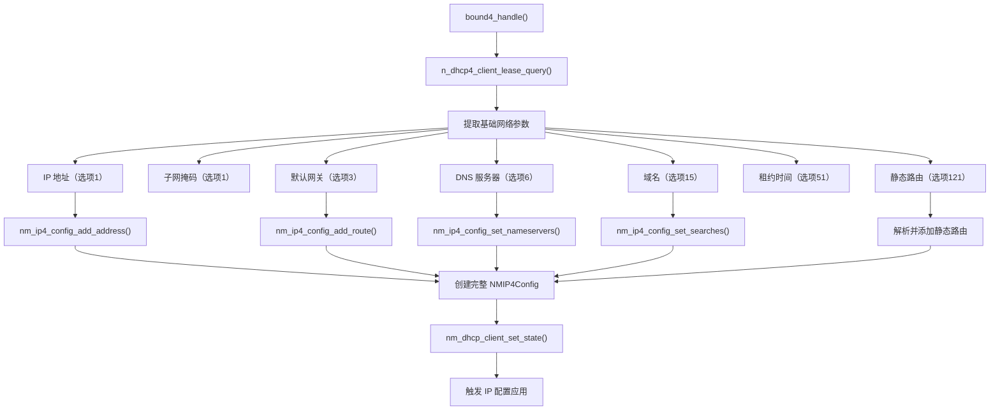
```mermaid
flowchart TD
    A["bound4_handle()"] --> B["n_dhcp4_client_lease_query()"]
    B --> C["提取基础网络参数"]

    C --> D["IP 地址（选项1）"]
    C --> E["子网掩码（选项1）"]
    C --> F["默认网关（选项3）"]
    C --> G["DNS 服务器（选项6）"]
    C --> H["域名（选项15）"]
    C --> I["租约时间（选项51）"]
    C --> J["静态路由（选项121）"]

    D --> K["nm_ip4_config_add_address()"]
    F --> L["nm_ip4_config_add_route()"]
    G --> M["nm_ip4_config_set_nameservers()"]
    H --> N["nm_ip4_config_set_searches()"]
    J --> O["解析并添加静态路由"]

    K --> P["创建完整 NMIP4Config"]
    L --> P
    M --> P
    N --> P
    O --> P

    P --> Q["nm_dhcp_client_set_state()"]
    Q --> R["触发 IP 配置应用"]
```

### DHCP IP 地址租期到期行为详解

1. 设置租期的目的
   高效利用 IP 资源：回收不再使用的 IP，分配给新设备。
   适应网络变化：设备移动或下线后，其 IP 地址可被回收。
   自动更新配置：在租期到期前更新网络配置。
2. 续租流程与逻辑
   客户端不会等待租期到期，而是通过两个关键时间点（T1, T2）主动续租，其决策流程如下：

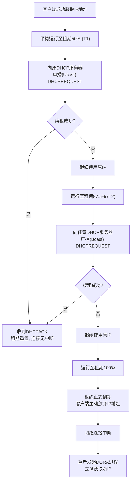
```mermaid
flowchart TD
A[客户端成功获取IP地址] --> B["平稳运行至租期50% (T1)"]
B --> C["向原DHCP服务器<br>单播(Ucast) DHCPREQUEST"]
C --> D{续租成功?}
D -- 是 --> E["收到DHCPACK<br>租期重置, 连接无中断"]
D -- 否 --> F[继续使用原IP]
F --> G["运行至租期87.5% (T2)"]
G --> H["向任意DHCP服务器<br>广播(Bcast) DHCPREQUEST"]
H --> I{续租成功?}
I -- 是 --> E
I -- 否 --> J[继续使用原IP]
J --> K["运行至租期100%"]
K --> L["租约正式到期<br>客户端主动放弃IP地址"]
L --> M["网络连接中断"]
M --> N["重新发起DORA过程<br>尝试获取新IP"]
```

3. NetworkManager 续租策略

- 角色：NetworkManager 作为管理者，通常调用底层的 DHCP 客户端（如 dhclient）来执行具体的报文交互，但其自身控制着续租的计时（T1, T2）、触发和重试逻辑。
- 配置：续租行为可以通过 NetworkManager 的配置进行调整。
  - ipv4.dhcp-timeout：设置获取或续租 IP 的超时时间。
  - ipv4.may-fail：决定在无法获取 IP 时是否仍保持连接激活。
- 租约详细信息（IP、租期、DNS 等）通常记录在 `/var/lib/NetworkManager/*-<interface>.lease`。

### 内部客户端优势与特点

#### 技术优势

- **零外部依赖**：无需安装 dhclient 或其他 DHCP 客户端
- **直接集成**：通过 GIO 事件循环无缝集成
- **内存效率**：避免进程间通信开销
- **状态同步**：实时状态反馈，无需解析外部进程输出

#### 协议特性

- **完整 RFC 2131 支持**：标准 DHCP 协议实现
- **高级选项支持**：静态路由（121）、域搜索（119）等
- **快速重连**：支持 INIT-REBOOT 状态快速获取已知 IP
- **智能超时**：动态调整重试间隔和超时时间

#### 实现细节

- **事件驱动**：基于 epoll 的高效事件处理
- **内存安全**：C 实现但具有资源自动管理
- **随机化支持**：启动延迟和交易 ID 随机化

### 关键数据结构

```c
// src/dhcp/nm-dhcp-nettools.c
typedef struct {
    NDhcp4Client *client;           // n-dhcp4 客户端实例
    NDhcp4ClientProbe *probe;       // 当前探测对象
    NDhcp4ClientLease *lease;       // 当前租约
    GIOChannel *channel;            // GIO 事件通道
    guint event_id;                 // 事件监听器 ID
    char *lease_file;               // 租约文件路径
} NMDhcpNettoolsPrivate;

// shared/n-dhcp4/src/n-dhcp4-private.h
struct NDhcp4Client {
    NDhcp4ClientConfig *config;     // 客户端配置
    CList event_list;               // 事件队列
    int fd_epoll;                   // epoll 文件描述符
    int fd_timer;                   // 定时器文件描述符
    NDhcp4ClientProbe *current_probe; // 当前探测
    uint64_t scheduled_timeout;     // 计划超时时间
};

struct NDhcp4ClientProbe {
    unsigned int state;             // 当前状态
    struct in_addr last_address;    // 上次获得的地址
    uint64_t ns_deferred;           // 延迟动作超时
    NDhcp4ClientLease *current_lease; // 当前租约
    NDhcp4CConnection connection;   // 连接封装
};
```

### 调试和故障排除

#### 日志记录

- n-dhcp4 库通过 `nettools_log()` 回调记录详细日志
- 支持 syslog 级别映射到 NetworkManager 日志级别
- 事件和状态转换都有详细记录

#### 常见问题

- **地址冲突**：自动检测并请求新地址
- **服务器 NAK**：智能重启延迟避免快速重试
- **网络中断**：保持状态机完整性，支持快速恢复

---

## 802.1X（Wired EAP）详细流程

802.1X 是一个基于端口的网络访问控制协议，用于有线和无线网络的设备认证。在有线网络中，它通常用于企业环境下控制网络接入。

### 认证过程概述

1. **预认证阶段**：

   - 检查载波状态（物理连接）
   - 准备认证所需的凭据（证书、密码等）
   - 初始化 supplicant（wpa_supplicant）

2. **EAP 认证阶段**：

   - EAP-Start（可选）
   - EAP-Request/Identity
   - EAP-Response/Identity
   - EAP-Request（特定方法）
   - EAP-Response（特定方法）
   - EAP-Success/Failure

3. **密钥协商阶段**（如果需要）：

   - 生成会话密钥
   - 验证密钥
   - 安装密钥

### 认证方法支持

NetworkManager 支持多种 EAP 方法：

- EAP-TLS（证书认证）
- EAP-TTLS（隧道认证）
- PEAP（受保护 EAP）
- EAP-MD5（简单密码认证）
- EAP-FAST（思科快速认证）

### 详细状态流程

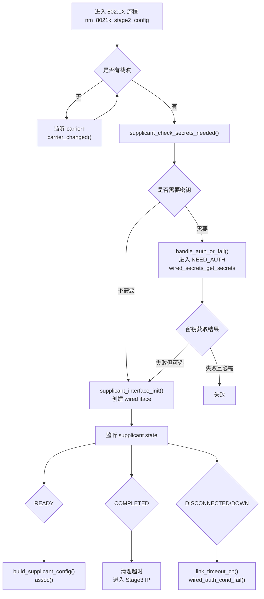
```mermaid
flowchart TD
    A["进入 802.1X 流程 nm_8021x_stage2_config"] --> B{"是否有载波"}
    B -->|无| C["监听 carrier↑<br/>carrier_changed()"] --> B
    B -->|有| D["supplicant_check_secrets_needed()"]
    D --> E{"是否需要密钥"}
    E -->|需要| F["handle_auth_or_fail()<br/>进入 NEED_AUTH<br/>wired_secrets_get_secrets"]
    E -->|不需要| G["supplicant_interface_init()<br/>创建 wired iface"]
    F --> H{"密钥获取结果"}
    H -->|失败且必需| I["失败"]
    H -->|失败但可选| G
    G --> J["监听 supplicant state"]
    J --> K{"READY"}
    K --> L["build_supplicant_config()<br/>assoc()"]
    J --> M{"COMPLETED"}
    M --> N["清理超时<br/>进入 Stage3 IP"]
    J --> O{"DISCONNECTED/DOWN"}
    O --> P["link_timeout_cb()<br/>wired_auth_cond_fail()"]
```

### EAP 交互流程

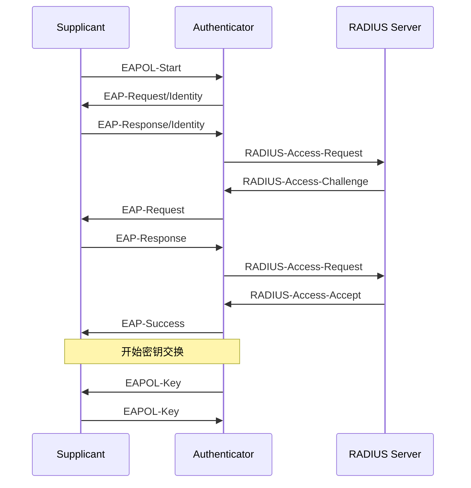
```mermaid
sequenceDiagram
    participant S as Supplicant
    participant A as Authenticator
    participant R as RADIUS Server

    S->>A: EAPOL-Start
    A->>S: EAP-Request/Identity
    S->>A: EAP-Response/Identity
    A->>R: RADIUS-Access-Request
    R->>A: RADIUS-Access-Challenge
    A->>S: EAP-Request
    S->>A: EAP-Response
    A->>R: RADIUS-Access-Request
    R->>A: RADIUS-Access-Accept
    A->>S: EAP-Success
    Note over S,A: 开始密钥交换
    A->>S: EAPOL-Key
    S->>A: EAPOL-Key
```

### 重要配置选项

- `auth_alg`: 认证算法选择
- `eap`: EAP 方法列表
- `phase1`: 外层认证参数
- `phase2`: 内层认证参数（TTLS/PEAP）
- `ca_cert`: CA 证书路径
- `client_cert`: 客户端证书
- `private_key`: 私钥
- `identity`: 身份标识
- `password`: 密码
- `anonymous_identity`: 匿名身份（外层）

### 错误处理机制

1. **认证失败处理**:

   - 证书验证失败
   - 密码错误
   - 服务器不可达
   - EAP 方法不匹配

2. **重试机制**:

   - 立即重试（快速恢复）
   - 延迟重试（避免过载）
   - 放弃重试（达到最大次数）

3. **可选认证模式**:

   - `802-1x.optional=true` 时失败可继续
   - 适用于混合环境（部分端口需要认证）

### 补充说明

- `supplicant_connection_timeout_cb()` 按是否有历史连接决定请求新密钥与否
- 可选认证失败时可继续进入 IP 配置阶段
- 支持动态调整 EAP 方法（服务器协商）
- 证书验证可配置严格度

---

## PPPoE 详细流程

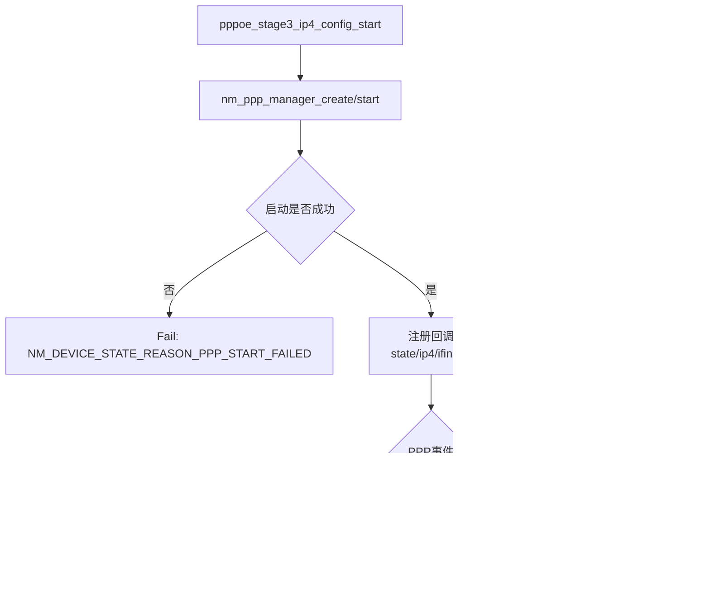
```mermaid
flowchart TD
    A["pppoe_stage3_ip4_config_start"] --> B["nm_ppp_manager_create/start"]
    B --> C{"启动是否成功"}
    C -->|否| D["Fail: NM_DEVICE_STATE_REASON_PPP_START_FAILED"]
    C -->|是| E["注册回调<br/>state/ip4/ifindex"]
    E --> F{"PPP事件"}
    F -->|IFINDEX_SET| G["nm_device_set_ip_ifindex"]
    F -->|IP4_CONFIG| H["nm_device_activate_schedule_ip_config_result"]
    F -->|DISCONNECT/DEAD| I["Fail"]
```

---

## DCB/FCoE 等待状态机

DCB 启用与配置需要在多个“载波上/下”窗口之间穿行：

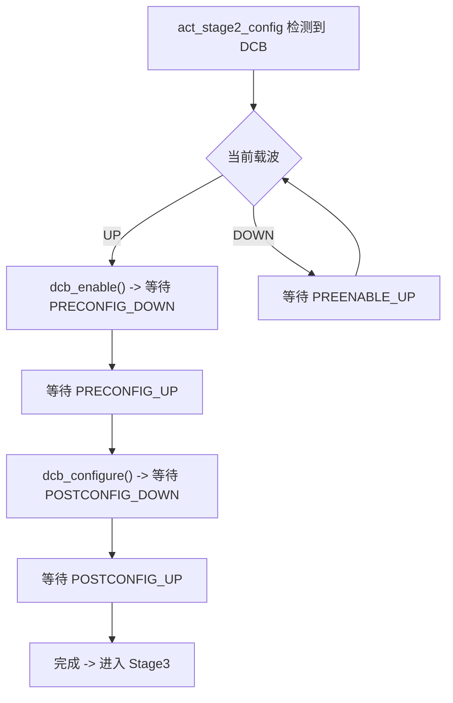
```mermaid
flowchart TD
    A["act_stage2_config 检测到 DCB"] --> B{"当前载波"}
    B -->|UP| C["dcb_enable() -> 等待 PRECONFIG_DOWN"]
    B -->|DOWN| D["等待 PREENABLE_UP"]
    C --> E["等待 PRECONFIG_UP"]
    E --> F["dcb_configure() -> 等待 POSTCONFIG_DOWN"]
    F --> G["等待 POSTCONFIG_UP"]
    G --> H["完成 -> 进入 Stage3"]
    D --> B
```

---

## 关键函数调用链与源码映射

文件：`src/devices/nm-device-ethernet.c`

```c
// Stage 1
act_stage1_prepare()
└── link_negotiation_set()
    └── nm_platform_ethtool_set_link_settings(...)

// Stage 2
act_stage2_config()
├── nm_8021x_stage2_config()                 // 需要 802.1X 时
│   ├── supplicant_check_secrets_needed()
│   │   ├── handle_auth_or_fail() / wired_secrets_get_secrets()
│   │   └── supplicant_interface_init()
│   └── supplicant_iface_state_cb()          // READY/COMPLETED/DISCONNECTED
├── wake_on_lan_enable()
└── DCB 流程：dcb_enable() / dcb_configure() / dcb_state()

// Stage 3
act_stage3_ip_config_start()
└── pppoe_stage3_ip4_config_start()          // 当连接类型为 PPPoE
    ├── nm_ppp_manager_start()
    ├── ppp_ifindex_set() / ppp_ip4_config()
    └── ppp_state_changed()

// 其他
carrier_changed()                            // 载波触发 802.1X 初始化
supplicant_connection_timeout_cb()           // 802.1X 连接超时处理
link_timeout_cb()                            // 已激活后断开重试/询问密钥
```

相关设置：

- `NM_SETTING_WIRED_*`（速率/双工/自协商、WOL）
- `NM_SETTING_802_1X_*`（可选/必需、证书/密码等）
- `NM_SETTING_PPPOE_*`（用户名/服务名，MRU/MTU）
- `NM_SETTING_DCB_*`

---

## 阅读建议与排错要点

- 802.1X 失败但 optional=true：继续进入 IP（可能仅限于允许未认证通行的端口）
- PPPoE 连续重连失败：关注上次断开时间与对端节流，`PPPOE_RECONNECT_DELAY`
- DCB 配置经常引发短暂载波抖动；确保超时窗口足够且按顺序等待
- 链路协商写入失败时，仅记录警告并继续，不会阻断激活

---

## 核心源文件映射

- 以太网设备：`src/devices/nm-device-ethernet.c`, `src/devices/nm-device-ethernet-utils.c`
- DHCP 管理：`src/dhcp/nm-dhcp-manager.c`, `src/dhcp/nm-dhcp-client.c`
- DHCP 客户端实现：
  - dhclient: `src/dhcp/nm-dhcp-dhclient.c`
  - systemd: `src/dhcp/nm-dhcp-systemd.c`
  - dhcpcd: `src/dhcp/nm-dhcp-dhcpcd.c`
  - nettools: `src/dhcp/nm-dhcp-nettools.c`
- 内部 DHCP 库（n-dhcp4）：
  - 核心实现: `shared/n-dhcp4/src/n-dhcp4-client.c`
  - 探测状态机: `shared/n-dhcp4/src/n-dhcp4-c-probe.c`
  - 连接管理: `shared/n-dhcp4/src/n-dhcp4-c-connection.c`
  - 公共接口: `shared/n-dhcp4/src/n-dhcp4.h`
- PPPoE 管理：`src/devices/nm-device-ethernet.c`（集成 PPP 管理器调用），`src/ppp/`
- supplicant（wired）：`src/supplicant/`
- 平台/内核交互：`src/platform/`
