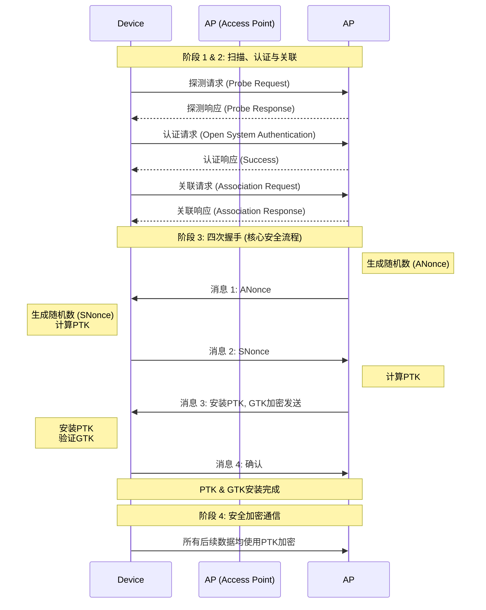

详细解析一下设备（如手机、电脑）使用 WPA/WPA2/WPA3 协议连接一个受保护的 Wi-Fi 网络并进行认证的完整过程。

这个过程可以清晰地分为四个主要阶段：

- 扫描与发现
- 认证与关联
- 四次握手（核心认证与密钥生成）
- 加密数据传输

为了更直观地理解整个过程，我们可以通过下面的流程图来概览其核心步骤和交互逻辑：

## 阶段 1：扫描与发现

设备首先要找到周围有哪些可用的无线网络，wpa 有 background scan 的逻辑，固定时间在后台进行扫描。另外，NetworkManager 也会发送扫描的请求。

### 被动扫描

设备的无线网卡监听周围接入点发出的**信标帧**。信标帧中包含了网络的重要信息，例如：

- **SSID**：网络的名称
- **支持的认证和加密方式**：如 WPA2-Personal, WPA3-Enterprise 等
- **其他参数**：如支持的速率、频道等

### 主动扫描

设备也可以主动在每个频道上广播**探测请求帧**。收到探测请求的接入点会回复**探测响应帧**，其内容与信标帧类似。

通过这两种方式，设备就获得了可用网络的列表，并从中选择目标网络。在 UOS 系统中，选择网络的过程是用户或者 NetworkManager 来处理。

## 阶段 2：认证与关联

在选择网络后，设备需要先通过一个"初步认证"，然后正式申请加入网络。

### 认证阶段

1. **认证请求**：设备向接入点发送一个认证请求。在 WPA 及之后的协议中，这实际上是一个"开放式系统认证"的握手，它只是一个形式上的请求，并不进行真正的安全验证，其目的是告知接入点"我有一个设备想要连接你"。

2. **认证响应**：接入点回复一个认证响应，表示"我允许你开始认证流程"。

### 关联阶段

1. **关联请求**：设备发送关联请求，正式请求加入该网络。请求中包含了设备的能力信息，如支持的数据速率、加密套件等。

2. **关联响应**：接入点回复关联响应，其中包含了一个关联 ID 以及表示"允许接入"的成功状态码。

> **注意**：至此，设备在逻辑上已经连接到接入点，但还不能传输任何数据，因为还没有建立加密密钥。

## 阶段 3：四次握手（核心安全流程）

这是整个 WPA 连接过程中最核心、最关键的一步。其核心目标是：在不直接传输密钥本身的情况下，让设备和接入点共同推导出相同的加密密钥。

### 前提条件

设备和接入点都共享着一个秘密：要么是 WPA-PSK 的预共享密钥，要么在企业版中，是由认证服务器分发的主密钥。

### 握手的目标

1. **身份认证**：确认双方拥有相同的预共享密钥，从而完成身份认证
2. **生成 PTK**：为本次会话生成一个独一无二的、临时性的**成对临时密钥**（PTK），用于加密单播数据
3. **分发 GTK**：协商并加密传输**组临时密钥**（GTK），用于加密广播和组播数据

四次握手的详细过程：

### 消息 1：接入点 -> 设备

接入点生成一个随机数 ANonce，并将其发送给设备。
设备的作用：收到 ANonce 后，结合预共享密钥，设备也能生成一个随机数 SNonce。现在设备拥有了：SSID、预共享密钥、ANonce、SNonce。利用这些参数，通过一套标准的密码学函数，设备可以计算出本次会话的成对临时密钥。

### 消息 2：设备 -> 接入点

设备将自己生成的 SNonce 发送给接入点。
接入点的作用：接入点收到 SNonce 后，它现在也拥有了：SSID、预共享密钥、ANonce、SNonce。它用同样的密码学函数计算出自己的 PTK。如果设备和接入点拥有相同的预共享密钥，那么它们计算出的 PTK 也必定是完全相同的。

### 消息 3：接入点 -> 设备

接入点生成 组临时密钥。
接入点将 GTK 和一条消息（用于确认密钥已安装）用刚刚生成的 PTK 进行加密，然后发送给设备。
设备的作用：设备用自己计算出的 PTK 解密这个消息。如果能成功解密，并且消息内容正确，则证明了：
接入点拥有正确的预共享密钥（因为只有这样才能算出相同的 PTK）。
PTK 已经生成，设备可以安装并使用它来加密发送数据和解密接收数据了。
设备安装 PTK 和 GTK。

### 消息 4：设备 -> 接入点

设备发送一条确认消息（同样用 PTK 加密）给接入点。
接入点的作用：成功解密这条消息后，接入点确认设备也拥有正确的 PTK，并且密钥已经安装完毕。接入点随后也安装 PTK 和 GTK。
四次握手完成后，双方已经完成了相互认证，并且拥有了用于加密本次会话数据的临时密钥。此时，安全的数据通道才正式建立。

## 阶段 4：加密数据传输

从此之后，设备和接入点之间传输的所有单播数据帧都将使用 PTK 进行加密和完整性校验。所有的广播/组播数据帧则使用 GTK 进行加密。

## 总结与关键点

| 阶段       | 主要目的           | 关键信息                              |
| ---------- | ------------------ | ------------------------------------- |
| 扫描与发现 | 发现可用网络       | 信标帧/探测响应中包含 SSID 和加密类型 |
| 认证与关联 | 建立初步连接       | 只是一个形式，不提供安全              |
| 四次握手   | 核心认证与密钥生成 | 验证预共享密钥，动态生成 PTK 和 GTK   |
| 数据传输   | 安全通信           | 所有数据使用 PTK/GTK 加密             |

## 重要概念区分

### WPA-Personal vs WPA-Enterprise

**个人版（WPA-Personal）**：

- 使用预共享密钥（PSK）
- 所有用户共享同一个密码
- 四次握手验证的就是这个预共享密码

**企业版（WPA-Enterprise）**：

- 使用 802.1X/EAP 认证
- 用户输入独立的用户名和密码
- 与 RADIUS 服务器进行认证
- 认证成功后，服务器和用户会生成一个主会话密钥（MSK），并分发给接入点
- 随后的四次握手使用的是这个 MSK 而不是预共享密钥
- 为每个用户生成不同的 PTK，安全性更高

### WPA2 vs WPA3

**WPA2**：

- 是当前最广泛使用的标准
- 其四次握手过程如上所述
- 存在离线字典攻击的风险

**WPA3**：

- 增强了安全性，特别是针对离线字典攻击
- WPA3-Personal 使用了 SAE（Simultaneous Authentication of Equals）的方式
- 即使密码较弱，也能有效抵抗攻击
- 其握手流程更为复杂和安全，但核心目标依然是安全地生成会话密钥

## 结语

希望这个详细的分解能帮助您彻底理解 WPA 的连接和认证过程。WPA 协议通过精心设计的四次握手机制，在保证安全性的同时，实现了设备与无线网络的可靠连接。
